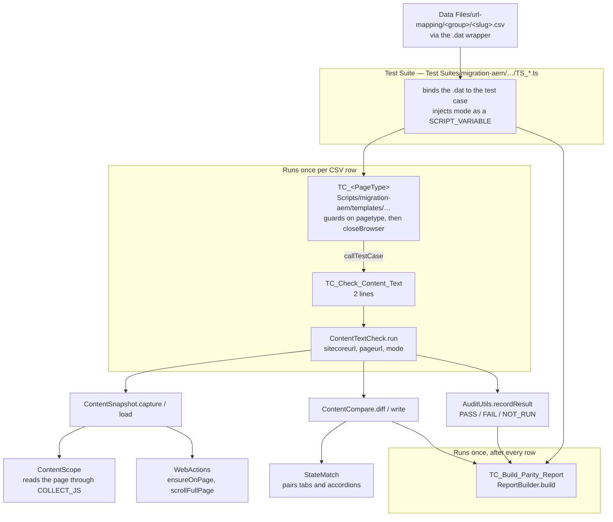
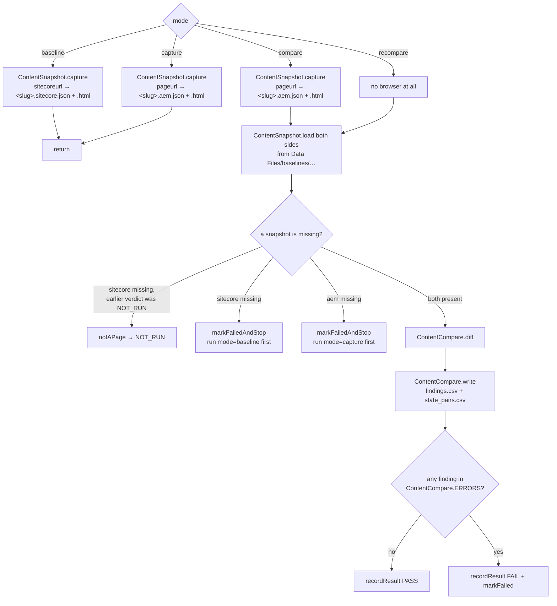
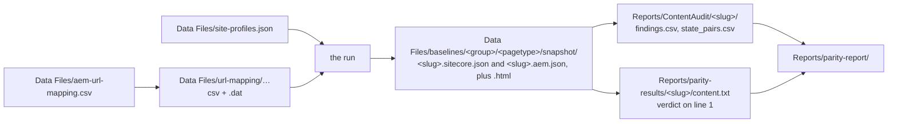

# Workflow — what runs, in what order, in which mode

The map you read before the others. [how-the-check-works.md](how-the-check-works.md) explains
*how a page is judged*; this page explains *what code runs to get there*, and what the four modes
change.

Everything is one check — `content` — so there is exactly one path through the project.

## 1. The call chain

Five layers. Each one does a single thing, and the layer above never reaches past the one below.



Two things that surprise people:

- **`WebUI.closeBrowser()` lives in the template test case**, not in the check. The check never
  opens or closes a browser itself — it asks `ContentSnapshot` for a snapshot, and that is the only
  place a driver is touched.
- **The report test case is a second test case in the same suite**, so the report is built **once
  per suite run**, not once per page. `ReportBuilder` reads what the per-page runs left on disk; it
  never calls a check. That boundary is the subject of
  [../reference/report-contract.md](../reference/report-contract.md).

The template test case is also the only place that can refuse a row:

```groovy
if (pagetype != 'general-content-detail-page') { ...; return }
```

a safety net for the day a wider data file gets bound to it.

## 2. The four modes

`mode` is a plain string injected by the suite — `'baseline'`, `'capture'`, `'compare'`,
`'recompare'`. `ContentTextCheck.run` branches on it and nothing else does.

| mode | crawls | diffs | needs Chrome | needs VPN | suite |
|---|---|---|---|---|---|
| `baseline` | the **live Sitecore** page | – | yes | no | `TS_*_Baseline` |
| `capture` | the **AEM** page | – | yes | yes | `TS_*_Capture` |
| `compare` | the **AEM** page | yes | yes | yes | `TS_*_Compare` |
| `recompare` | – | yes | no | no | `TS_*_Recompare` |

Why the split: crawling is the expensive half, comparing is the half that gets re-run every time a
matching rule changes. `recompare` re-judges an existing crawl in seconds, offline.



Two early exits worth knowing before you go hunting for a bug:

- **A URL that serves a PDF** has no snapshot and never will. `notAPage()` records `NOT_RUN` —
  neither a pass nor a failure, and the report renders it as "does not apply".
- **`recompare` honours a previously recorded `NOT_RUN`** — see `recordedVerdict()`. Without it,
  a re-judge would demand a baseline capture that is guaranteed to reach the same conclusion again.

The gate itself is one list, and it does not care how large the page is:

```groovy
// Keywords/migration/checks/ContentCompare.groovy
static final List ERRORS = ['MISSING_ON_AEM', 'WRONG_TAB', 'NUMBER_CHANGED', 'LINK_CHANGED']
```

> **Note on the score.** [../reference/verdicts-and-score.md](../reference/verdicts-and-score.md)
> specifies a 0-100 score alongside the verdict, but `ContentCompare` on disk has no `WEIGHTS` and
> no `score()`, `write()` emits no `weight` column and no `score.csv`, and `ReportBuilder` renders
> no score. The verdict path drawn above is the part that actually runs today.

## 3. Which suite to run

| Goal | Suite under `Test Suites/migration-aem/` |
|---|---|
| Capture the live side, General Content Detail | `normal-pages/by-page/TS_GeneralContentDetailPage_Baseline` |
| Capture the AEM side only | `normal-pages/by-page/TS_GeneralContentDetailPage_Capture` |
| Capture + judge in one run | `normal-pages/by-page/TS_GeneralContentDetailPage_Compare` |
| Re-judge without re-crawling | `normal-pages/by-page/TS_GeneralContentDetailPage_Recompare` |
| PRULink funds, capture + judge | `custom-pages/by-page/TS_IlpFund_Compare` |

The group suites (`TS_Normal_*`, `TS_Custom_*`) bind page-type test cases that do not exist yet —
see [../guides/running-tests.md](../guides/running-tests.md).

The normal order for a new page type is **baseline → capture → compare/recompare**: capture the
live side while it is still live, capture the new side once it is built, then re-judge as often as
the rules change.

### A capture overwrites its snapshot, and a bad capture looks like a good one

`ContentSnapshot.capture()` writes `<slug>.<side>.json` with `setText` — no comparison against
what is already there, no backup. Its only guard (`items < 10`) is a **warning, and it is logged
after the file has already been written**. So a crawl that reads the page wrongly replaces a good
baseline, the run goes green, and nothing says the data is gone.

This has happened: on 2026-08-19 a `baseline` run at 16:40 replaced all eight Sitecore snapshots
with 3-item files (the `var a` bug, changelog 2026-08-20). The compare results from 16:25 —
127, 180, 187 items — survived only because they live in `Reports/`, and the snapshots that
produced them do not exist any more.

**After every `baseline` or `capture` run, open one of the JSON files it wrote and check three
fields before trusting anything downstream:**

| Field | Healthy, for a General Content Detail page | Broken |
|---|---|---|
| `items` | 150–400 | under 10 |
| `skipped.scanned` | 1,000–1,600 | under 50 — the walk died early |
| `rootText` | 10,000+ characters | short or empty |

`items` far below `scanned` is normal (most elements carry no text of their own). `scanned` far
below the element count of the page is not: it means the item walk stopped, and everything after
that point was never read.

## 4. Files in, files out



`aem-url-mapping.csv` is the single source of URLs; the per-type files are generated slices of it
and must stay in sync. Selectors never live in code — they live in `site-profiles.json`.

## 5. The re-judge loop

`TS_GeneralContentDetailPage_Recompare` re-runs `ContentCompare.diff/write` +
`AuditUtils.recordResult` over every snapshot already on disk and then rebuilds the report — no
browser, no VPN. It is how a change to a matching rule gets checked against real numbers before
anything touches the live sites. (The former `tools/offline-checks/run.sh replay`, which did the
same outside Studio, was removed on 2026-08-20.)
